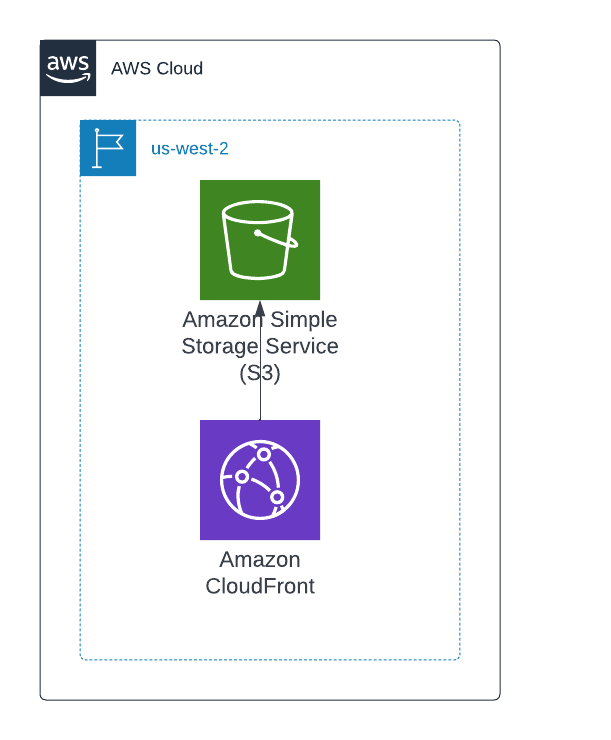

# Terraform-SCS-S3-Cloudfront

1. Start in the tfstate folder.
2. Rename terraform.tfvars.example to terraform.tfvars.
3. Change the variables in terraform.tfvars.
4. Run terraform init.
5. Run terraform apply.
6. Navigate to the top level directory.
7. Rename the terraform.tvars.example file to terraform.tfvars.
8. Change variables in terraform.tfvars.
9. Change the [bucket name](https://github.com/doverto1/terraform-scs-s3-cloudfront/blob/5e713ae2c22ebd6113a6d8744d2f392a96bd427a/providers.tf#L11) 
